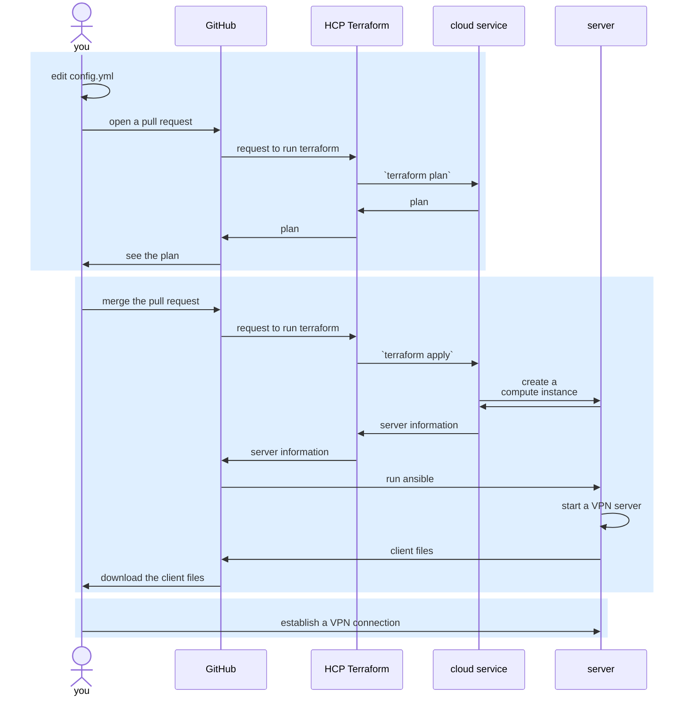

# summary

This is Infrastructure as Code applied to VPN.
You can automate deployment of VPN tunneling servers
for personal use with Terraform and Ansible executed in GitHub Actions.

# key features

- fully automated deployment and removal of VPN servers
- multicloud support
- VPN connections on TCP port 443 (typically used for HTTPS) and UDP port 53 (typically used for DNS)
- completely personal VPN servers at locations of your choice

# overview

# supported environments

## cloud services and compute resources to run VPN servers on

- AWS
  - Lightsail
- Google Cloud
  - Compute Engine

## OS

- Ubuntu 24.04

## VPN application

- OpenVPN

> [!NOTE]  
> WireGuard is planned

## protocols

### transport layer

- TCP (port 443)
- UDP (port 53)

### network layer

- IPv4
- IPv6

# prerequisites

- accounts
  - [GitHub](https://docs.github.com/en/get-started/start-your-journey/creating-an-account-on-github)
  - [HCP Terraform](https://developer.hashicorp.com/terraform/tutorials/cloud-get-started/cloud-sign-up)
  - one or more of
    - [AWS](https://aws.amazon.com/resources/create-account/)
    - [Google](https://support.google.com/accounts/answer/27441) for Google Cloud
- VPN client application

# steps

## copy this repository

[Use the template feature](https://docs.github.com/en/repositories/creating-and-managing-repositories/creating-a-repository-from-a-template).

## initialize the project
### 1. allow HCP Terraform to access the cloud services

#### 1.1. set up HCP Terraform

1. [create an organization](https://www.terraform.io/cloud-docs/users-teams-organizations/organizations#creating-organizations)
1. [create a workspace](https://www.terraform.io/cloud-docs/workspaces/creating)

#### 1.2. set up OIDC integration

##### AWS

see https://developer.hashicorp.com/terraform/cloud-docs/dynamic-provider-credentials/aws-configuration

##### Google Cloud

see https://developer.hashicorp.com/terraform/cloud-docs/dynamic-provider-credentials/gcp-configuration

#### 1.3. [set workspace-specific variables](https://www.terraform.io/cloud-docs/workspaces/variables/managing-variables#workspace-specific-variables) as follows

> [!NOTE]  
> replace `****` with your values

##### AWS

| category | key | value | sensitive |
| -------- | --- | ----- | --------- |
| environment | TFC_AWS_PROVIDER_AUTH | `true` | no |
| environment | TFC_AWS_RUN_ROLE_ARN | `arn:aws:iam::****:role/****` | no |

##### Google Cloud

| category | key | value | sensitive |
| -------- | --- | ----- | --------- |
| environment | TFC_GCP_PROVIDER_AUTH | `true` | no |
| environment | TFC_GCP_RUN_SERVICE_ACCOUNT_EMAIL | `****@developer.gserviceaccount.com` | no |
| environment | TFC_GCP_WORKLOAD_PROVIDER_NAME | `projects/****/locations/global/workloadIdentityPools/****/providers/****` | no |

### 2. allow GitHub to access HCP Terraform

#### 2.1. [create a team API token](https://www.terraform.io/cloud-docs/users-teams-organizations/api-tokens#team-api-tokens) of HCP Terraform

#### 2.2. [set a repository secret](https://docs.github.com/en/actions/security-guides/using-secrets-in-github-actions#creating-secrets-for-a-repository)

| name | value |
| ---- | ----- |
| `HCP_TERRAFORM_TEAM_TOKEN` | HCP Terraform team API token |

### 3. allow GitHub to access your servers in the cloud

#### 3.1. create an SSH key pair

1. go to the GitHub Actions page and [manually run the workflow](https://docs.github.com/en/actions/managing-workflow-runs/manually-running-a-workflow#running-a-workflow) to [create an SSH key pair](.github/workflows/keygen.yml)

2. [download the zipped artifact](https://docs.github.com/en/actions/managing-workflow-runs/downloading-workflow-artifacts)

    The artifact in GitHub will be automatically deleted in 1 day.

3. unzip the downloaded file

    A file with the `.pub` extension is a public key.
    The other file is a private key.

#### 3.2. set the SSH key pair for GitHub Actions

##### 3.2.1. [set a repository secret](https://docs.github.com/en/actions/security-guides/using-secrets-in-github-actions#creating-secrets-for-a-repository)

| name | value |
| ---- | ----- |
| `SSH_PRIVATE_KEY` | SSH private key |

##### 3.2.2. [set a repository variable](https://docs.github.com/en/actions/how-tos/write-workflows/choose-what-workflows-do/use-variables#creating-configuration-variables-for-a-repository)

| name | value |
| ---- | ----- |
| `SSH_PUBLIC_KEY` | SSH public key |

#### 3.3. delete the downloaded SSH key files

## add / remove servers, or add clients

1. add or edit `config.yml`

See [config-example.yml](config-example.yml) for example.

> [!TIP]  
> You can use `get-blueprints` and `get-bundles` commands in
> [CloudShell](https://docs.aws.amazon.com/cloudshell/latest/userguide/getting-started.html) to
> [list Lightsail blueprints and bundles](https://repost.aws/knowledge-center/lightsail-aws-cli-commands).

2. open a pull request
3. check the plan at the summary on the GitHub Actions page
4. merge the pull request if the plan is fine
5. check the deployment on the GitHub Actions page

> [!TIP]  
> You can add more servers or clients by running the same steps.

> [!TIP]  
> to remove the existing servers, remove them in the `servers` section in `config.yml`
> and follow the same steps as to add servers

## make a VPN connection on clients

1. [download](https://docs.github.com/en/actions/how-tos/manage-workflow-runs/download-workflow-artifacts) VPN client files from the GitHub Actions page
1. optionally, edit the files as you like
1. move the files to each client
1. make a VPN connection on each client using the VPN application
